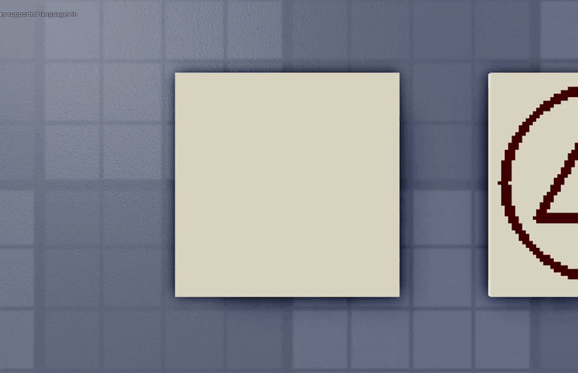
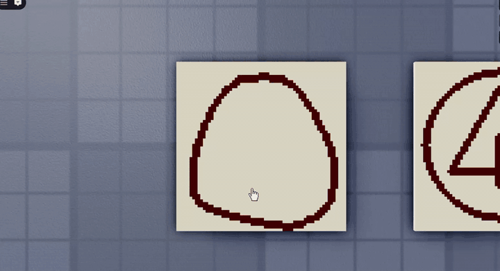

# sigil-recognition

A real-time hand-drawn glyph recognition system for casting spells in Roblox. Players draw a "sigil" (the central glyph that selects which element) plus optional "signs" around it (smaller glyphs that modulate the spell's form: direction, sustain, etc.). A pair of int8-quantized MLPs running in pure Luau classify the drawing and the cast resolves on the server.

## Demo

**Non-directional cast**: sigil drawn inside the ring with no shaping signs, so the spell resolves as an AoE form:



**Directional cast**: adding a column (T) sign points the spell along that axis, here as a horizontal beam:



## What it does

The player clicks a "spell paper" part in the world, the camera tweens overhead, and they draw on a 64×64 grid surface attached to the part. After every stroke the system:

1. **Detects a closed ring** by flood-filling from the canvas border. The drawn cells the flood can't reach are "inside the ring."
2. **Splits the inside ink into 4-connected components**: the central sigil plus any smaller marks placed around it.
3. **Classifies each component**: small ones get tried against the **sign** model (column / levitation / `_other`); whatever isn't a sign gets merged into a single sigil mask and run through the **sigil** model (fire / water / earth / wind / `_other`).
4. **Resolves direction geometrically** for sigils with prongs (sector-extremum ratio) and for signs by which rotation gave the best classification score.
5. **Glows the paper for 1 s, then fires the cast remote** to the server, which dispatches to the matched sigil's `onCast` with the sign list as context.

A spell's *form* comes from the signs, not the sigil. A fire sigil with no signs is an AoE fireball; with column signs aligned in a direction it's a beam; with a levitation sign it's a sustained orb.

## Repo layout

```
src/                                 Roblox source (Rojo-compatible)
  SpellSystem/
    Config.lua                       single source of truth for tunables
    Util/Bresenham.lua               line / disk / stroke / circle primitives
    Canvas/
      GridBuffer.lua                 N×N binary grid (the fundamental data type)
      Canvas.lua                     attaches a SurfaceGui to a Part
    Recognition/
      RingDetector.lua               flood-fill border to find enclosed ink
      ComponentFinder.lua            4-connected components
      Normalizer.lua                 bbox-crop + nearest-neighbor resample
      SigilMatcher.lua               entry point for sigil classification
      SignMatcher.lua                entry point for sign classification (rotation-aware)
      Inference.lua                  int8-quantized MLP forward pass in pure Luau
      MLMatcher.lua                  ML classifier wrapping Inference
      SigilModel.lua                 generated weights (~88 KB, pasted from train.py)
      SignModel.lua                  generated weights
    Sigils/                          one module per sigil, self-registering
      Registry.lua, Fire.lua, Water.lua, Earth.lua, Wind.lua, ElementalVariants.lua
    Signs/
      Registry.lua, Column.lua, Levitation.lua
    Spells/
      Caster.lua                     evaluate / activate / glow lifecycle
      ElementalCombat.lua
    ClientEffects/                   VFX dispatched on cast
      Beam.lua, Explosion.lua, Shockwave.lua, Sustain.lua, MagicCombat.lua, Registry.lua
    VFX/AssetCatalog.lua
  StarterPlayerScripts/SpellClient.client.lua    canvas + input driver
  ServerScriptService/SpellServer.server.lua     authoritative cast handler

training/                            Python training pipeline
  train.py                           load templates → augment → train MLPs → quantize → emit Lua
  export_templates.luau              run in Studio's Command Bar to dump templates.json
  templates.json                     canonical 32×32 glyph for each registered sigil/sign
  requirements.txt                   torch, numpy

media/                               demo recordings
default.project.json                 Rojo project file (sync this repo into Studio)
CLAUDE.md                            architectural handoff notes (load-bearing details + gotchas)
```

## The model

A tiny MLP, one per task:

```
input (32 × 32 = 1024)  →  Linear(64)  →  ReLU  →  Linear(C)  →  softmax
```

`C` is the number of registered sigils/signs plus an `_other` reject class. Both weight matrices are int8-quantized per-tensor symmetric (~88 KB on disk per model after base64 encoding), decoded once at runtime into a Roblox `buffer`, and a single forward pass takes ~5 ms in Luau on a server.

The reason for an MLP rather than just template-IoU matching: hand drawings vary in stroke thickness, position, and proportion in ways IoU can't tolerate without aggressive dilation, which then makes distinct glyphs collide. A small classifier learns the right invariances cheaply, and the `_other` class gives it a way to *reject* random scribbles instead of always picking the closest registered glyph.

A dilated-IoU template matcher remains in the codebase as a fallback; if the model module is empty (placeholder) the matcher falls through to it, so the system stays functional during dev.

## Training pipeline

`train.py` produces `SigilModel.lua` / `SignModel.lua` that get pasted into Studio.

1. **Export**: paste `training/export_templates.luau` into Studio's Command Bar. It clones the registries (sidesteps any stale `require` cache), iterates registered entries, and prints the canonical 32×32 grid for each as JSON. Save as `training/templates.json`.
2. **Augment**: each canonical template is replicated 800× per class via random rotation (sigils ±25°, signs full ±180°), scale ±15%, ±3 cell translation, dilation 0–2, stroke-drop, and salt-and-pepper noise. The `_other` class gets 1.5× more samples generated as random lines/arcs/blobs.
3. **Train**: 30 epochs, Adam, cross-entropy, batch 64. ~30–60 s on CPU.
4. **Quantize and emit**: weights → int8 → base64 → Lua module file.
5. **Paste**: copy the generated `.lua` files into the corresponding ModuleScripts in Studio.

```
cd training
pip install -r requirements.txt
python train.py
```

## Adding a new sigil

Mirror `src/SpellSystem/Sigils/Fire.lua`:

- `buildVisual(buf)` draws the canonical glyph into a `GridBuffer` using `Bresenham` primitives.
- `buildTemplate()` renders a full ring + visual on a 64×64 canvas, runs `RingDetector.detect`, normalizes the inside-ink to 32×32.
- `onCast(ctx)` runs server-side effects, with `ctx.signs` describing the surrounding signs.
- Optional `verify(normalized, raw) -> bool` for per-class shape checks (Fire's verifier enforces the central vertical line).

Then re-export, retrain, and re-paste the model files.

## Why this is interesting

A few problems that took some thought:

- **Cross-runtime model deployment.** PyTorch trains, but inference has to run in Luau without HTTP. The pipeline ends with the training script writing a Lua module containing base64-encoded int8 weights, and a hand-rolled `linear / relu / softmax` in pure Luau decoding into a `buffer`. ~5 ms per forward pass.
- **Decomposing a noisy drawing into sigil + signs.** The flood-fill ring detector + 4-connected component finder cleanly separates the central glyph from peripheral marks without needing to hard-code positions. Sign rotation is recovered by sweeping 12 rotations through the model and keeping the highest-scoring orientation.
- **Resisting false positives.** A naive classifier always returns *something*, and players draw nonsense all the time. The `_other` reject class plus a confidence threshold keep the matcher quiet when the input isn't a real glyph; per-class verifiers catch shapes that pass classification but are missing required structural features (e.g., a Fire glyph without the central vertical line).
- **Modular sigil/sign registry.** Adding a new spell is one file: define the visual, define `onCast`, register. The matcher and training pipeline pick it up automatically.

See `CLAUDE.md` for the full architectural breakdown including the gotchas that shaped the current design (sticky require cache, normalizer aspect-ratio mismatches, component-merging vs. central-component-only, etc.).
